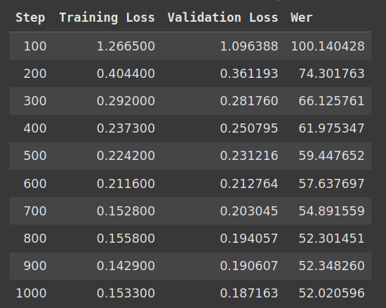

This repo contains sample code for fine tuning an OpenAI Whisper (https://arxiv.org/abs/2212.04356) model with Sinhala langauge audio and transcriptions available at https://openslr.org/52/. 

- The ```audio_folder_creation.py``` script creates a metadata file named ```metadata.csv``` in the same location as a single unzipped data directory (ex: asr_sinhala_0.zip). The file containing the utterences ```utt_spk_text.tsv``` should be copied to this location.
- The ```whisper_sinhala_fine_tuning.ipynb``` python notebook can be used to fine tune the model. This notebook has been tested in Google Colab, and expects the resulting data from the above step to be available as a ```data.zip``` fil in Google Drive.
- Once unzipped, the notebook expects ```data/``` directory to contain the following:
  ```data ----
            |---- train
                    |---- *.flac
                    '
                    |---- metadata.csv
            |---- test
                    |---- *.flac
                    '
                    |---- metadata.csv
  ```
- The ```metadata.csv``` file contains the name of the audio file with the transcription.
  ```
  file_name,transcription
  010009989d.flac,හෝටල්වල ගිනි මැල හදනවා.
  010062fad4.flac,මරණින් මතු පැවැත්ම
  ```
- This notebook is a modified version from the hugging face tutorial on fie tuning Whisper: https://huggingface.co/blog/fine-tune-whisper. Please follow the information in the original huggingface blog post for installing required python dependecies.

The losses and WER for a fine tuning process over 1000 steps using one dataset (asr_sinhala_0.zip) from https://openslr.org/52/ is shown below:  


